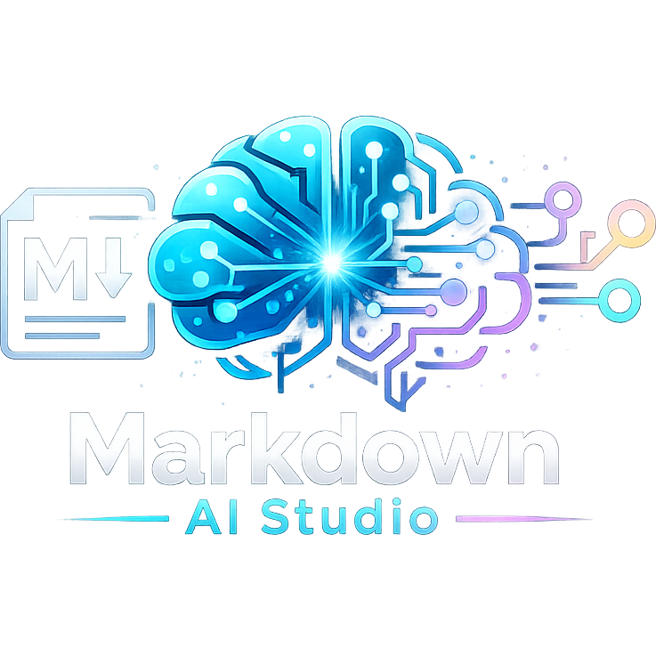

# AI Markdown Studio Community

<p align="center">
  
</p>

AI Markdown Studio Community is the MIT-licensed open-source core of AI Markdown Studio.

It provides preview-first Markdown authoring, live document and presentation previews, Mermaid, KaTeX, syntax highlighting, table formatting, document and presentation themes, speaker notes in presentation view, AI-assisted document and presentation generation, AI Paste to Markdown, HTML export, and basic DOCX export.

AI Markdown Studio Pro is a separate product that extends Community with AI theme generation, file conversion, PDF/PPTX export, high-fidelity DOCX, Copilot agent tools, and corporate PowerPoint template automation. Pro depends on Community; Community contains no Pro implementation.

## Start Here

- [Extension README](./apps/ai-markdown-studio-vs-community/README.md) - full user guide, feature tour, security notes, and Pro comparison
- [Extension Manifest](./apps/ai-markdown-studio-vs-community/package.json) - the VS Code extension entrypoint and contributed commands/settings
- [Workspace Package](./package.json) - the private workspace scripts and shared dependency pins

## Installation

Install from the VS Code Marketplace:

```powershell
code --install-extension GustavoSerpa.markdown-ai-studio
```

Or install a packaged build directly from a `.vsix` file:

```powershell
code --install-extension markdown-ai-studio-0.2.0.vsix
```

## Highlights

- Preview-first custom editor for Markdown files
- Live Markdown and presentation previews
- Mermaid diagrams with strict-mode rendering
- KaTeX math rendering
- Theme support for document and presentation views
- AI-assisted document and presentation generation through the GitHub Copilot service already configured in VS Code
- AI Paste to Markdown
- HTML export and basic DOCX export
- Command launcher and settings shortcuts built into the editor UI

## Development

```powershell
npm install
npm run verify
```

`npm run verify` runs the Community boundary check, builds the workspace packages, runs tests, and packages the VSIX.

The packaged extension README is generated from `apps/ai-markdown-studio-vs-community/README.md`, so keep that file as the user-facing source of truth.

## License

MIT. See [LICENSE](LICENSE).
