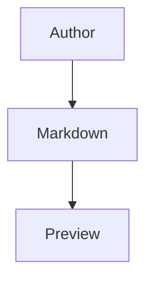

# AI Markdown Studio Community — User Guide

AI Markdown Studio Community turns VS Code into a focused Markdown authoring environment with live previews, AI-assisted document and presentation creation, AI Paste to Markdown, HTML export, and basic DOCX export.

This guide covers everything in the Community edition. Advanced conversion, theme creation, higher-fidelity exports, and corporate PowerPoint templates are available in **AI Markdown Studio Pro**.

## Contents

- [Getting started](#getting-started)
- [The preview-first model](#the-preview-first-model)
- [Commands](#commands)
- [Guided AI generation](#guided-ai-generation)
- [AI Paste to Markdown](#ai-paste-to-markdown)
- [Markdown preview](#markdown-preview)
- [Document themes](#document-themes)
- [Presentation preview](#presentation-preview)
- [Presentation themes](#presentation-themes)
- [Front matter](#front-matter)
- [Table formatting](#table-formatting)
- [HTML export](#html-export)
- [Settings reference](#settings-reference)
- [Privacy and remote resources](#privacy-and-remote-resources)
- [Upgrading to Pro](#upgrading-to-pro)
- [Troubleshooting](#troubleshooting)

## Getting started

1. Install **AI Markdown Studio Community** from the Extensions view, or run `code --install-extension GustavoSerpa.markdown-ai-studio`.
2. Open any `.md` file. It opens in the **preview** by default.
3. Use the pencil (**Edit Markdown**) icon in the preview's title bar to switch to the text editor, and the eye (**Preview Markdown**) icon to switch back.

No account, sign-in, or network connection is required for authoring, preview, themes, HTML export, or basic DOCX export. The optional AI features use the GitHub Copilot service already configured in VS Code. If Copilot is not configured, the AI commands stay hidden.

## The preview-first model

Opening a Markdown file shows the rendered preview first. Switching between preview and editing keeps everything in one tab, so your workspace stays uncluttered.

You can switch modes in several ways:

- **Editor title bar** — the eye icon (**Preview Markdown**) when editing, and the pencil icon (**Edit Markdown**) when previewing.
- **Editor title bar** — the split icon (**Open Opposite View Beside**) keeps the current surface open and opens the other one beside it.
- **Command Palette** (`Ctrl+Shift+P`) — run **Preview Markdown** or **Edit Markdown**.
- **Command launcher** — run **Show AI Markdown Studio Commands** and pick a mode.
- **Explorer file context menu** — right-click a Markdown file and choose **Edit Markdown** to open it directly as text.

## Commands

All commands are available from the Command Palette (`Ctrl+Shift+P`). The most common ones also appear in the editor title bar for `.md` files.

| Command | What it does |
| --- | --- |
| **Preview Markdown** | Opens or focuses the rendered preview for the current file. |
| **Edit Markdown** | Switches the current file to the text editor. |
| **Open Opposite View Beside** | Opens the preview beside the editor, or the editor beside the preview. |
| **Format Markdown Tables** | Aligns every Markdown table in the active file. Also runs via **Format Document**. |
| **Export Markdown as HTML** | Saves the rendered document as a standalone `.html` file. |
| **Export Markdown as DOCX (Basic)** | Saves the current document as a basic Word file. Pro automatically replaces this with its advanced DOCX export. |
| **Generate Document (AI)** | Creates a Markdown document from your brief. |
| **Generate Presentation (AI)** | Creates a Markdown presentation from your brief. |
| **Paste as New Markdown File** | Turns clipboard text into a new Markdown file. |
| **Enable AI Features...** | Reviews the AI data-sharing notice and enables AI features. |
| **Toggle Frontmatter** | Shows or hides the rendered front-matter summary in the active preview. |
| **Open Global Document Theme Folder** | Opens the folder where shared document themes are stored. |
| **Show AI Markdown Studio Commands** | Opens a quick-pick launcher of the extension's main actions. |
| **Change Settings...** | Opens the VS Code Settings UI filtered to this extension. |

## Guided AI generation

Community provides guided workflows for creating both documents and presentations. If GitHub Copilot is configured in VS Code, the AI commands appear in the Command Palette and prompt you the first time you use them. If you explicitly deny AI access, the AI commands hide again and only **Enable AI Features...** stays visible.

- **Generate Document (AI)** asks what you want to create, then lets you generate it with GitHub Copilot or copy the instructions for use with another AI tool.
- **Generate Presentation (AI)** works the same way, while ensuring the result follows AI Markdown Studio's presentation format.

Both workflows create a new Markdown file and open it for review without changing your current document. Choosing **Copy Prompt** does not contact Copilot; it copies the instructions to your clipboard.

## AI Paste to Markdown

Right-click a folder in the Explorer and choose **Paste as New Markdown File** to turn clipboard text into a new Markdown file. AI Markdown Studio chooses a suitable filename, avoids overwriting existing files, and opens the result.

Use this command only when you are comfortable sending the clipboard text to GitHub Copilot.

## Markdown preview

The preview renders your document in real time as you type. It supports:

- standard Markdown — headings, lists, links, images, bold, italic, blockquotes, horizontal rules
- fenced code blocks with **syntax highlighting** (highlight.js)
- **Mermaid** diagrams in ` ```mermaid ``` ` fenced blocks
- **math** with KaTeX — inline `$...$` and block `$$...$$`
- **task lists**, **footnotes**, and **emoji**
- **local images** stored beside your document or elsewhere in your project
- selectable **document themes**

### Mermaid diagrams and zoom

Write a diagram in a `mermaid` fenced block:

````markdown

````

Each rendered diagram has a **Zoom** control. Click it, or double-click the diagram, to open a larger viewer. Use **+**, **-**, **Fit**, or the keyboard: `+` to zoom in, `-` to zoom out, `0` to fit, and `Esc` to close.

### Math

Inline math uses single dollar signs, e.g. `$E = mc^2$`. Block math uses double dollar signs:

```markdown
$$
\int_0^\infty e^{-x}\,dx = 1
$$
```

## Document themes

Standard (non-presentation) documents can follow VS Code's theme automatically or use a bundled theme.

Bundled document themes:

- `auto` (follows VS Code light/dark) — the default
- `light`, `light-modern-blue`
- `dark`, `dark-aurora-noir`, `dark-modern-aurora`, `night-sky`

Set the default for all documents with the **`markdownAiStudio.documentPreviewTheme`** setting, or override per file with a `theme` field in front matter:

```yaml
---
theme: light-modern-blue
---
```

### Custom document themes

You can add your own document theme files. AI Markdown Studio looks for them in:

- `.markdown-ai-studio/document-themes/` in your project folder, and
- the folder set in **`markdownAiStudio.globalDocumentThemeDirectory`** (shared across workspaces).

Use **Open Global Document Theme Folder** to create and open that global folder in your file explorer. After adding or editing a theme file, reopen the preview to pick it up.

## Presentation preview

When a Markdown file declares `document: presentation` in its front matter, the preview automatically switches from the scrolling document view to a **slide-based presentation viewer**. Files without that field stay on the standard preview.

Presentation preview features:

- **Slide navigation** — previous/next controls.
- **Keyboard navigation** — arrow keys, `Page Up`, `Page Down`, `Home`, `End`.
- **Filmstrip** — a collapsible strip of slide thumbnails for quick jumps.
- **Fullscreen** — immersive mode via the on-screen control or the `F` key; press `Esc` to exit.
- **Fixed-canvas scaling** — fullscreen preserves the exact slide composition from the smaller panel.
- **Speaker notes** — shown below the active slide when present.
- **Template-aware layouts** — `cover`, `default`, `two-columns`, `image-right`, and `divider`.

### Authoring a presentation

A presentation is one Markdown file split into slides:

```markdown
---
document: presentation
title: Quarterly Review
author: Jane Doe
theme: galaxy
ratio: "16:9"
---

# Quarterly Review

Opening slide.

---

<!--slide: two-columns-->
## Highlights

- Revenue up
- Churn down

<!--notes: Emphasize the revenue trend here.-->

---

<!--slide: image-right-->
## Roadmap


```

- The information block at the top must include `document: presentation`. It can also include `title`, `author`, `theme`, and `ratio`.
- `---` on its own line separates slides.
- `<!--slide: template-name-->` overrides the layout for a single slide.
- `<!--notes: ...-->` or `<!--speaker notes: ...-->` attaches speaker notes to a slide.

> The same structure is used by AI Markdown Studio Pro to export `.pptx` decks, so presentations authored in Community export directly in Pro without changes.

## Presentation themes

Bundled presentation themes: `black`, `galaxy`, and `modern-blue`. Set a deck's theme with the `theme` front-matter field.

Custom presentation themes are loaded from:

- `.markdown-ai-studio/presentation-themes/` in your project folder, and
- the folder set in **`markdownAiStudio.previewThemeDirectory`** (shared across workspaces).

## Front matter

Front matter is the information block at the top of a file, between `---` lines. It can set options such as `document: presentation`, `theme`, `ratio`, `title`, and `author`.

Use **Toggle Frontmatter** (also a title-bar control when the active preview has front matter) to show or hide a rendered summary of the front matter in the preview. This lets you keep metadata visible while authoring without it cluttering the final reading view.

## Table formatting

Run **Format Markdown Tables** to align every Markdown table in the active file into evenly padded columns, making the raw Markdown easier to read and diff.

This command is also registered as a document formatter, so **Format Document** (`Shift+Alt+F`) on a `.md` file reformats its tables too. You can enable format-on-save for Markdown if you want tables aligned automatically.

## HTML export

Run **Export Markdown as HTML** to save the current document as a self-contained `.html` file you can share or open in any browser. The export bundles the extension's rendered styling so the output looks like the preview.

Whether remote resources referenced in the document may be loaded is governed by **`markdownAiStudio.allowRemoteResources`** (see below).

## DOCX export

Run **Export Markdown as DOCX (Basic)** to save the current document as a Word file. This export is designed to work across operating systems and produce a clean, readable document.

When **AI Markdown Studio Pro** is installed, its advanced DOCX export takes over automatically.

> PDF/PPTX export and high-fidelity DOCX remain Pro features.

## Settings reference

Open settings with **Change Settings...**, or `Ctrl+,` and search for `markdownAiStudio`.

| Setting | Default | Description |
| --- | --- | --- |
| `markdownAiStudio.previewPageWidth` | `full` | `full` lets standard preview pages use the whole panel width; `readable` constrains them to a centered column. |
| `markdownAiStudio.documentPreviewTheme` | `auto` | Default document preview theme. Overridable per file via the `theme` front-matter field. |
| `markdownAiStudio.globalDocumentThemeDirectory` | empty | Folder containing document themes shared across projects. |
| `markdownAiStudio.previewThemeDirectory` | empty | Folder containing presentation themes shared across projects. |
| `markdownAiStudio.allowRemoteResources` | `true` | Whether previews and exports may load images and other content from the internet. |
| `markdownAiStudio.aiFeaturesEnabled` | `false` | Accepts AI-supported functionality that may use the GitHub Copilot service already configured in VS Code for document generation, presentation generation, and AI Paste to Markdown. |
| `markdownAiStudio.aiAuthorizationDenied` | `false` | Records that you explicitly denied AI access. When this is on, the AI commands stay hidden except for **Enable AI Features...**. |

## Privacy and remote resources

AI Markdown Studio Community has no product account or server component and does not collect telemetry. Outbound network activity can occur in two user-controlled situations:

- **AI commands:** after you enable AI features and GitHub Copilot is configured in VS Code, AI Markdown Studio may use the Copilot service already configured there for AI-supported functionality such as document generation, presentation generation, and AI Paste to Markdown. The content you provide is shared with that embedded AI service for processing. AI Markdown Studio does not connect to any other third-party AI service and does not bring its own AI account or credentials. Only enable AI features if you are authorized to share that content through your configured Copilot service.
- **Remote resources:** previews and exported HTML can load resources that your Markdown explicitly references, such as an image at an `https://` URL.

To prevent that — for example when reviewing untrusted documents or working in a restricted environment — set:

```json
{
  "markdownAiStudio.allowRemoteResources": false
}
```

As a general precaution, treat Markdown from untrusted sources carefully because it can reference local files and remote resources, and review sensitive text before sending it through an AI command. See [security-review.md](./security-review.md) for the full assessment.

## Upgrading to Pro

If you need the advanced automation and Office-native export layer, install **AI Markdown Studio Pro**:

- AI **Convert to Markdown** (PDF/DOCX/PPTX/image/text) and AI theme generation
- high-fidelity **DOCX**, **PDF**, and **PPTX** export
- export using your organization's existing **PowerPoint templates**
- deeper Copilot Chat workflows for creating and reviewing documents, presentations, and themes

Installing Pro automatically installs Community as its dependency, and your Community previews, themes, and presentations continue to work unchanged — Pro simply adds the advanced commands on top.

## Troubleshooting

**A Markdown file opens as plain text instead of preview.** Set AI Markdown Studio as the default editor for `.md` files, or run **Preview Markdown**.

**My presentation opens as a normal document.** Confirm the front matter includes `document: presentation` at the very top of the file, between `---` fences.

**A custom theme doesn't appear.** Confirm the theme file is in `.markdown-ai-studio/document-themes/`, `.markdown-ai-studio/presentation-themes/`, or your shared theme folder, then reopen the preview.

**A remote image doesn't load.** Check whether `markdownAiStudio.allowRemoteResources` is `false`, and confirm the URL is reachable and served over `https`.

**An AI command is missing.** If GitHub Copilot is not configured in VS Code, the AI commands stay hidden. If you previously denied AI access, use **Enable AI Features...** to review the notice again.

**Mermaid diagram shows an error.** The diagram source has a syntax error; the preview shows Mermaid's parse message. Fix the diagram definition and the preview updates.

**PDF/PowerPoint export, advanced file conversion, theme creation, or deeper Copilot Chat workflows are missing.** Those are Pro features. Install AI Markdown Studio Pro to add them.
