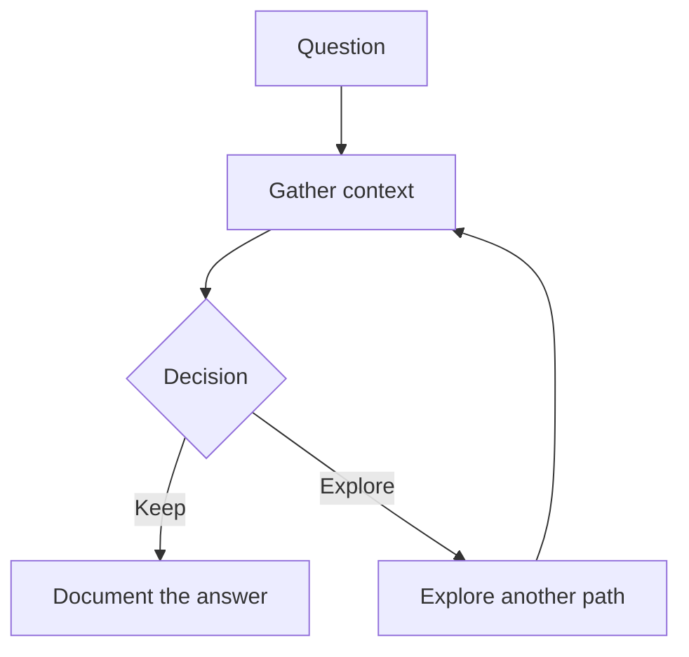
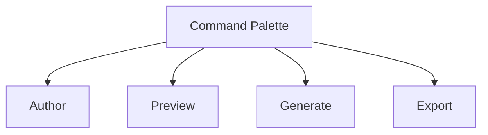

<!--slide: cover-->
# Markdown, made visible

## Meet AI Markdown Studio Community

Write in a format that lasts. Preview it like a finished product.

<!--notes: Welcome the audience to a quick tour of the open-source Community edition. The central idea is that Markdown stays simple while the authoring experience becomes visual and capable. -->

---

<!--slide: default-->
# Your ideas deserve an open format

Markdown is:

- Plain text that works everywhere
- Easy for people and AI systems to read
- Portable, diffable, and friendly to Git
- Stable enough to keep for the long term

> Keep the source simple. Change the experience whenever you need to.

<!--notes: Position Community as a practical home for durable knowledge, not another closed document silo. -->

---

<!--slide: image-right-->
# One file. Two ways to work.

Open a Markdown file and move naturally between:

- A focused text editor for authoring
- A live preview for reviewing the finished page
- A command launcher for the actions you use most


<!--notes: Show the loop rather than presenting authoring and preview as separate products. The preview-first custom editor is the default opening experience. -->

---

<!--slide: default-->
# Preview while you write

The live preview turns Markdown into a readable, theme-aware document as you type.

- Headings, lists, links, images, and inline formatting
- Syntax-highlighted code blocks
- Task lists, footnotes, and emoji
- Local images resolved relative to the source file

No build step. No publishing pipeline required to see the result.

---

<!--slide: two-columns-->
# Documents that can explain themselves

## Rich Markdown

- Tables with predictable structure
- Math with inline and block KaTeX
- Mermaid diagrams for flows and systems
- Front matter for metadata and behavior

## A calmer review loop

- Preview-first opening
- One surface per file
- Switch between edit and preview
- Keep the source readable in any editor

<!--notes: The feature list is deliberately split into content capability and workflow simplicity. -->

---

<!--slide: image-right-->
# Turn complexity into a diagram

Mermaid diagrams live directly in the Markdown source.



Zoom into the rendered diagram when the detail matters.

---

<!--slide: table-->
# Make tables readable again

| Need              | Community gives you                     |
| ----------------- | --------------------------------------- |
| Consistent source | Format Markdown Tables aligns cells     |
| Fast review       | Wide tables scroll without collapsing   |
| Narrow layouts    | Wrap mode fits content to the preview   |
| Repeatable habits | Format on save is available in Settings |

<!--notes: This is a good moment to demonstrate Format Markdown Tables from the Command Palette or Format Document. -->

---

<!--slide: divider-->
# From documents to decks

## The same Markdown can become a presentation

<!--notes: Transition from the document experience to presentation preview. -->

---

<!--slide: cover-->
# Presentation mode

Give a Markdown file a `document: presentation` front matter value and it becomes a slide-based deck.

<!--notes: Emphasize that the source remains Markdown. The presentation experience is a view over the document, not a new proprietary file format. -->

---

<!--slide: two-columns-->
# A presentation workflow built in

## Navigate with confidence

- Previous and next controls
- Arrow keys, Page Up, Page Down
- Home and End to jump
- Collapsible slide filmstrip

## Present with focus

- Immersive fullscreen mode
- Fixed-canvas scaling
- Speaker notes below the active slide
- Bundled presentation themes

---

<!--slide: default-->
# Layouts that give ideas a shape

Use a small, expressive vocabulary of slide templates:

`cover` &nbsp; `two-columns` &nbsp; `image-right` &nbsp; `table`

`side-banner` &nbsp; `divider` &nbsp; `thanks`

The content stays Markdown. A slide marker chooses the composition.

```md
&lt;!--slide: two-columns--&gt;
# Compare two approaches
```

---

<!--slide: image-right-->
# Themes are a presentation layer

Choose a bundled document or presentation theme without rewriting the source.

- `auto` follows the environment
- Light and dark document themes
- `black`, `galaxy`, and `modern-blue` presentation themes
- Theme choice can live in front matter

```yaml
theme: modern-blue
```

<!--notes: Explain the separation between content and presentation. It makes the same Markdown useful as a note, document, or deck. -->

---

<!--slide: divider-c-->
# AI when you ask for it

## Start from a brief. Get a Markdown document or deck.

<!--notes: Community includes opt-in, user-triggered AI-assisted generation. Mention that users review the AI authorization notice before enabling it. -->

---

<!--slide: default-->
# A blank page is no longer a blocker

With GitHub Copilot configured in VS Code, Community can help you create:

- A structured Markdown document from a prompt
- A presentation-style deck from a brief
- A first draft that remains editable, inspectable Markdown

The human stays in the authoring loop: prompt, preview, refine.

---

<!--slide: two-columns-->
# Paste messy text. Keep the meaning.

## AI Paste to Markdown

- Convert clipboard text into a new Markdown file
- Start from copied notes, outlines, or source material
- Keep the result in your workspace

## A thoughtful consent model

- AI features are opt-in
- The notice explains data sharing
- User-triggered actions may consume quota or incur charges
- Enabling confirms responsibility for those costs

<!--notes: Be direct about consent and cost. AI features should be useful without being surprising. -->

---

<!--slide: default-->
# Share beyond the editor

Community includes lightweight export paths for everyday sharing:

| Output          | Best for                           |
| --------------- | ---------------------------------- |
| Standalone HTML | A self-contained browser handoff   |
| Basic DOCX      | A familiar document attachment     |
| Markdown source | Git, review, automation, and reuse |

Export the rendered result without abandoning the source.

---

<!--slide: image-right-->
# A command center for the workflow

The command launcher keeps the important actions close:

- Preview or edit the current Markdown
- Format tables
- Generate documents and presentations
- Paste as a new Markdown file
- Export HTML or basic DOCX
- Open settings and enable AI features



---

<!--slide: table-legend-->
# Why teams start with Community

| Principle  | What it feels like                         |
| ---------- | ------------------------------------------ |
| Open       | MIT-licensed, plain-text source            |
| Visual     | Live document and presentation preview     |
| Capable    | Diagrams, math, tables, themes, and export |
| Extensible | A clean foundation for future workflows    |
| Human-led  | AI is available when the user triggers it  |

<!--notes: This is the product promise in one slide: open source underneath, polished workflow on top. -->

---

<!--slide: default-side-->
# Start with one Markdown file

1. Install **AI Markdown Studio Community** in VS Code.
2. Open or create a `.md` file.
3. Write, preview, and shape the content.
4. Add `document: presentation` when the idea wants slides.
5. Share the result as Markdown, HTML, or basic DOCX.

The best workflow is the one that keeps your ideas moving.

---

<!--slide: thanks-->
# Keep your knowledge moving

## AI Markdown Studio Community

Open source. Preview-first. Markdown-native.

### Write once. See more.

<!--notes: Close with the core message and invite the audience to try their own document, diagram, or presentation sample. -->
