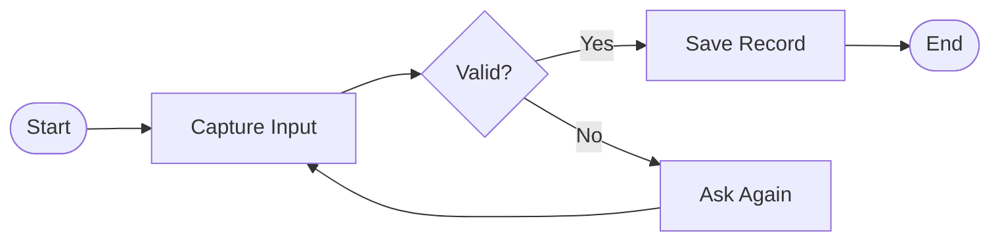
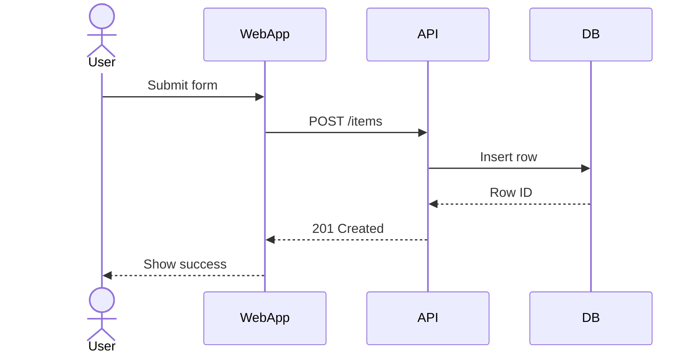
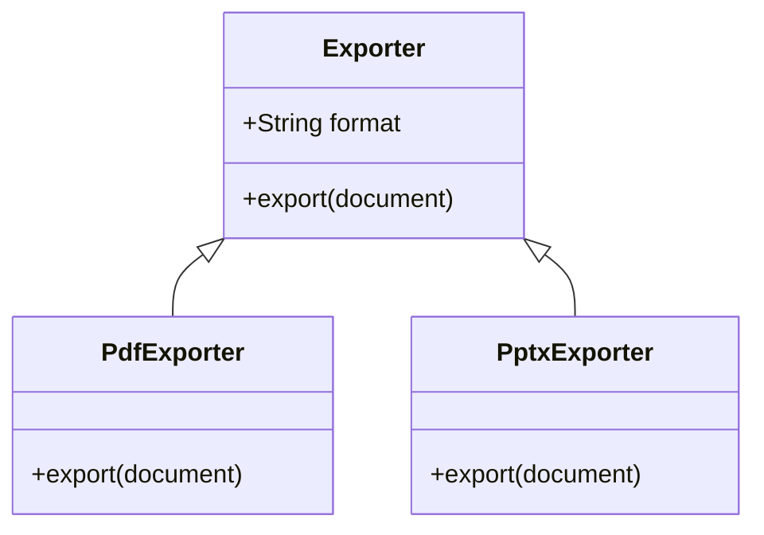
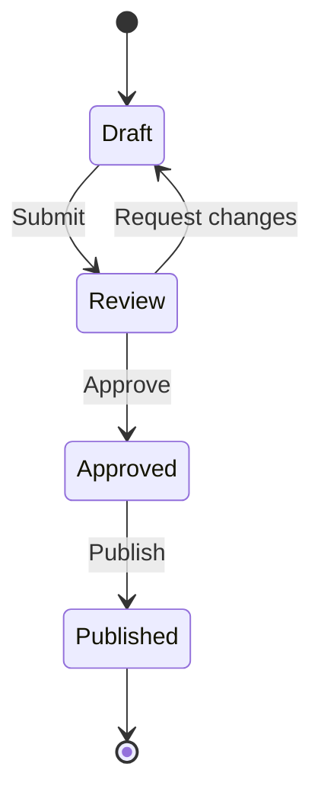
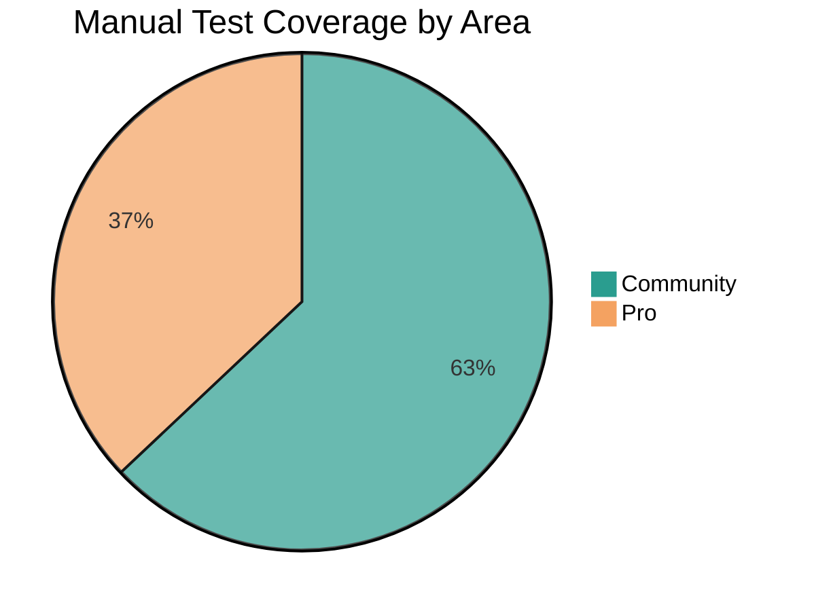
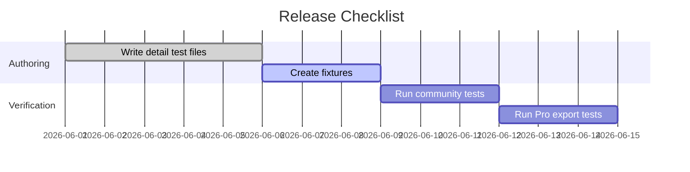
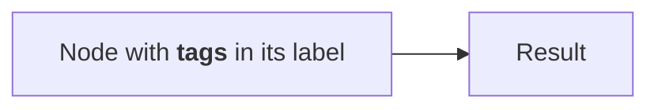
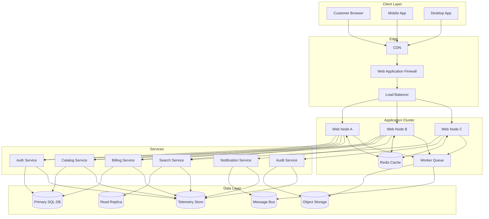
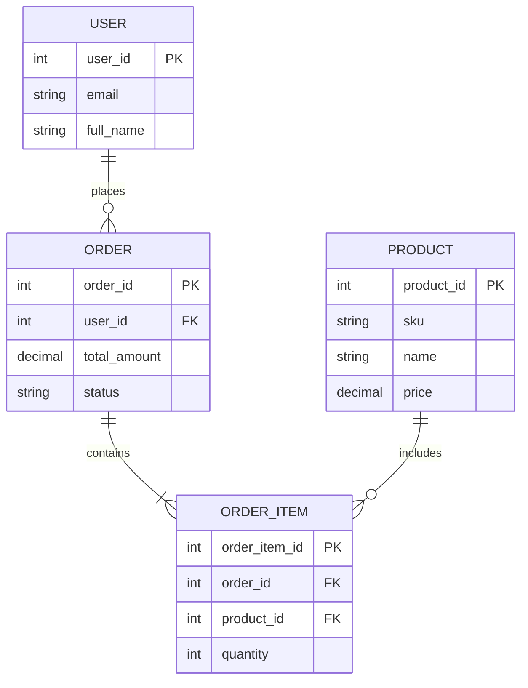
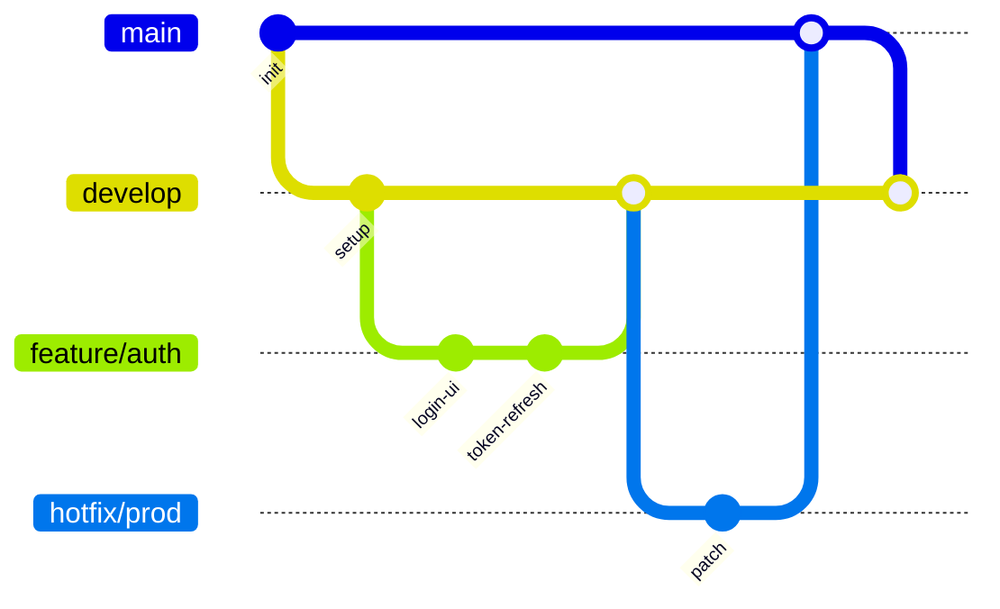

# Mermaid Diagram Gallery

A range of Mermaid diagram types for preview, zoom, and export (PDF/DOCX/PPTX)
testing. Each section is a self-contained diagram so individual cases can be
copied into other fixtures if needed.

## 1. Flowchart

A small flowchart for basic preview smoke-testing and zoom controls.

## 2. Sequence Diagram

## 3. Class Diagram

## 4. State Diagram

## 5. Pie Chart

## 6. Gantt Chart

## 7. Diagram with Click Directives and HTML-like Labels

Tests `securityLevel: 'strict'` during export — the click interactions and the
raw-looking tags in the label below should be neutralized rather than executed
or rendered as live HTML/links.

## 8. Large Diagram (Render-Time Stress Test)

A higher-complexity flowchart intended to push Mermaid's layout engine and
exercise the ~15 second render timeout used by export. If this diagram does
not finish rendering in time, document the resulting behavior (diagram
omitted vs. export failure).

## 9. Multiple Diagrams on One Page

The flowchart and sequence diagram above already demonstrate independent
rendering and zoom controls (markdown-rendering.md TC13) when both are open in
the same preview.

## 10. Entity Relationship Diagram

## 11. Git Graph

